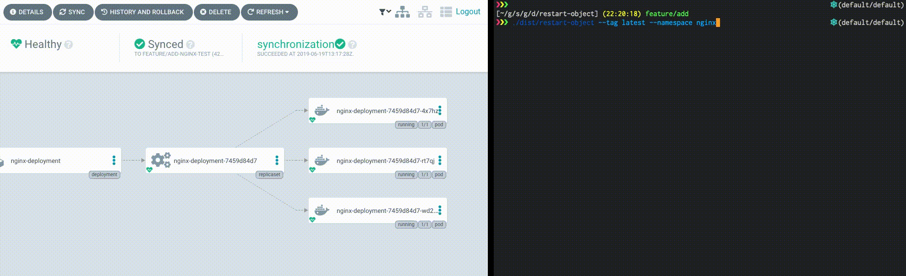

# restart-object

[](https://circleci.com/gh/d-kuro/restart-object) [](https://goreportcard.com/report/github.com/d-kuro/restart-object)

## About restart-object

restart-object can restart Kubernetes' Deployment / DaemonSet / StatefulSet.
It is intended to be run as a Kubernetes Job or CronJob and to restart Deployment.
Please add "imagePullPolicy: Always" to Pod.

Assumed to be used to restart the Pod running in the development environment with the latest image tags.

**Note: Do not use the latest image tag in a production environment.**

restart-object was created referring to the `kubectl rollout restart` command.
Realize restart by giving annotation `kubectl.kubernetes.io/restartedAt` for podTemplateSpec.



## Why restart Pod with CronJob ?

I have a motivation to periodically Deploy latest image the development environment application.
In GitOps, Git is a single source of truth.
So to deploy a new image you have to rewrite the manifests image tag and commit it to Git.
But the logic to monitor the image registry and commit it to Git is complicated.
I developed restart-object as a mechanism to realize this task easily.

## Build and Run

Build restart-object:

```shell
$ make build
```

and run restart-object:

```shell
$ ./dist/restart-object --tag latest --namespace nginx
```

For more information about available options run:

```shell
$ ./dist/restart-object --help
Restart Kubernetes Object

Usage:
  restart-object [flags]
  restart-object [command]

Available Commands:
  help        Help about any command
  version     Show version

Flags:
      --disable strings    Disable objects names
      --disable-all        Disable all objects
      --enable strings     Enable objects names
      --enable-all         Enable all objects
  -h, --help               help for restart-object
      --in-cluster         Execute for in Kubernetes cluster
      --namespace string   Namespace (default "default")
      --objects string     Restart objects (default "deployment")
      --tag string         Target to restart image tag name (default "latest")

Use "restart-object [command] --help" for more information about a command.
```

## Running restart-object as a Job Inside of a Pod

restart-object can be run as a Job inside of a Pod.

### Run the restart-object as a Job in a Pod:

```shell
$ kubectl apply -f ./examples/manifests/restart-object.yaml
```

### Manifests examples

* [examples/manifests/restart-object.yaml](examples/manifests/restart-object.yaml)

```yaml
apiVersion: batch/v1
kind: Job
metadata:
  name: restart-object-job
spec:
  completions: 1
  parallelism: 1
  template:
    spec:
      serviceAccountName: restart-object
      containers:
        - name: restart-object-job
          image: daikurosawa/restart-object:latest
          command:
            - ./restart-object
            - --in-cluster=true
            - --tag=latest
      restartPolicy: Never
---
apiVersion: v1
kind: ServiceAccount
metadata:
  name: restart-object
  namespace: default
---
apiVersion: rbac.authorization.k8s.io/v1
kind: ClusterRoleBinding
metadata:
  name: restart-object
roleRef:
  apiGroup: rbac.authorization.k8s.io
  kind: ClusterRole
  name: edit
subjects:
  - kind: ServiceAccount
    name: restart-object
    namespace: default
---
apiVersion: rbac.authorization.k8s.io/v1
kind: ClusterRole
metadata:
  name: restart-object
rules:
  - apiGroups: ["apps"]
    resources: ["deployments"]
    verbs: ["list", "patch"]
  - apiGroups: ["extensions"]
    resources: ["deployments"]
    verbs: ["list", "patch"]
```

## TODO

* [ ] Support DaemonSet restart
* [ ] Support StatefulSet restart
* [ ] Add tests
* [ ] Support server side apply
